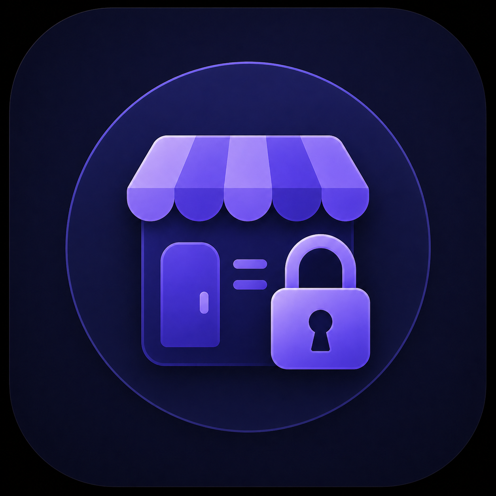
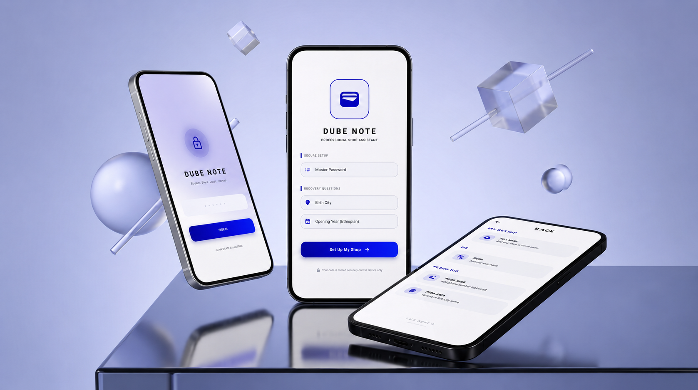

  <p align="center">
  
</p>

<h1 align="center">Dube Note</h1>

<p align="center">
  <strong>Online credit management system for small retail businesses</strong>
</p>

<p align="center">
  
  
  
  
  
  
</p>

---

## Overview

**Dube Note** is a production-grade mobile and web application purpose-built for small retail shop owners who extend informal credit to their customers. It replaces the traditional paper-based "dube" (credit notebook) with a secure, always-in-sync digital system.

Shop owners **create their own account** on sign-up and log in from any device. Once inside, they **register customers by assigning each one a unique username**, then record item-level credit transactions against that username. Because all data is stored centrally in the cloud, a shop owner's customer list and balances stay consistent whether they log in from a phone, tablet, or desktop — and nothing is lost if a device is replaced.

The application handles the complete credit lifecycle — from creating a shop owner account and registering customers, to recording transactions, calculating outstanding balances in real time, settling debts, and maintaining a full payment history — all synced online.

---

## Key Features

### Shop Owner Accounts
- **Account Registration** — Shop owners sign up with an email/username and password to create their own private workspace.
- **Secure Login** — Returning shop owners log in from any supported device; sessions are authenticated against the cloud backend.
- **Multi-Device Access** — Data follows the shop owner's account, not the device — switch phones or add a desktop client without losing history.

### Customer & Credit Management
- **Username-Based Customer Registry** — Register customers under a unique username per shop; look up, open, or edit a customer's record instantly by searching their username.
- **Item-Level Transactions** — Record each credit entry with item name, quantity, and unit price. Totals are computed automatically.
- **Real-Time Debt Calculation** — Outstanding balances are derived dynamically from unpaid transactions and kept in sync across devices, eliminating desync errors inherent in manual bookkeeping.
- **One-Tap Settlement** — Settle a customer's full balance in a single action; all unpaid transactions transition to the paid history archive.

### Security & Privacy
- **Encrypted Cloud Sync** — All data is transmitted over HTTPS/TLS and stored in a managed cloud database tied to the shop owner's account.
- **Authenticated Access** — Access is gated behind the shop owner's account credentials, verified against the backend on each session.
- **Password Recovery** — Standard email- or security-question-based account recovery flow for shop owners who forget their password.
- **Automatic Session Timeout** — Idle sessions are terminated after a period of inactivity, requiring re-authentication.

### Notifications & Sync
- **Deadline Reminders** — Push notifications alert the shop owner one day before and on the day of a customer's payment deadline, delivered via cloud messaging on **Android** and **iOS**.
- **Live Data Sync** — Changes made on one device (a new transaction, a settlement, a new customer) appear on any other device the shop owner is logged into, typically within seconds.
- **Cloud Backups** — Since data lives in the cloud, backups are automatic; a manual export option is still available for the shop owner's own records.

---

## 📱 UI Showcase

### Authentication and Onboarding



This screen represents the shop owner's sign-up / login flow, where the app authenticates against the cloud backend before the user enters the main credit management experience.

### Customer Management Flow

The same interface supports the day-to-day workflow: searching a customer by username, reviewing balances, opening customer records, and moving from active credit to paid history.

---

## Architecture

Dube Note follows a clean, layered architecture with a thin client and a cloud-hosted backend responsible for authentication, data storage, and sync.

```
lib/
├── main.dart                     # App entry point, session management
├── network/
│   └── api_client.dart           # HTTP client, request/response handling, auth headers
├── models/
│   ├── shop_owner.dart           # Shop owner entity (username, email, auth token)
│   ├── customer.dart             # Customer entity (username, name, note, deadline)
│   ├── app_transaction.dart      # Transaction entity (item, qty, price, status)
├── services/
│   ├── auth_service.dart         # Sign-up, login, token refresh, password recovery
│   ├── customer_service.dart     # Register/search/manage customers by username
│   ├── transaction_service.dart  # Create, sync, and settle transactions
│   └── notification_service.dart # Push notification registration & handling
├── screens/
│   ├── splash_screen.dart          # Session check & auto-login
│   ├── signup_screen.dart          # Shop owner account creation
│   ├── login_screen.dart           # Shop owner authentication & recovery
│   ├── dashboard_screen.dart       # Main view: total debt, customer list
│   ├── customer_detail_screen.dart # Per-customer balance & transaction list
│   ├── add_customer_screen.dart    # Register a new customer by username
│   ├── add_transaction_screen.dart # New credit entry form
│   ├── history_screen.dart         # Paid transaction archive
│   └── settings_screen.dart        # Account, sync status, app info
└── utils/
    └── theme.dart                # Design system: colors, typography, components
```

### Tech Stack

| Layer              | Technology                                                                 |
|--------------------|-----------------------------------------------------------------------------|
| **Framework**      | [Flutter](https://flutter.dev/) (Dart)                                    |
| **Backend API**     | Cloud-hosted REST/HTTPS API handling auth, customers, and transactions    |
| **Database**       | Cloud-hosted managed database (shop owners, customers, transactions)       |
| **Authentication** | Token-based auth (issued on login, refreshed per session)                 |
| **Notifications**  | Push notifications via cloud messaging — Android + iOS                    |
| **State Mgmt**     | `StatefulWidget` + `FutureBuilder`/async streams for live sync             |

> **Note:** The specific backend/database provider (e.g., a custom REST API, Firebase, or Supabase) should be documented here to match your actual implementation — update this section with the real service name, hosting details, and any required environment configuration once finalized.

---

## Application Flow

```
[ Start ]
           │
           ▼
  ┌─────────────────┐           ┌─────────────────┐           ┌─────────────────┐
  │  FIRST LAUNCH   │           │  SIGN UP SCREEN │           │    DASHBOARD    │
  │  (Auth Check)   │ ────────▶ │ (Shop Owner Acct)│ ────────▶ │ (Customer List) │
  └─────────────────┘           └─────────────────┘           └────────┬────────┘
           │                                                           │
           │ (If account exists)                                       │
           ▼                                                           │
  ┌─────────────────┐                                  ┌───────────────┼───────────────┐
  │  LOGIN SCREEN   │                                  ▼               ▼               ▼
  │  (Username/Pwd) │ ────────▶                ┌───────────────┐ ┌───────────┐   ┌──────────┐
  └─────────────────┘                          │ ADD CUSTOMER  │ │  HISTORY  │   │ SETTINGS │
                                               │ (by Username) │ └───────────┘   └──────────┘
                                               └───────┬───────┘
                                                       │
                                                       ▼
                                               ┌───────────────┐
                                               │ ADD TRANSAC.  │
                                               └───────────────┘
```

---

## Getting Started

### Prerequisites

- [Flutter SDK](https://docs.flutter.dev/get-started/install) (3.11.5+)
- Android Studio or VS Code with Flutter/Dart plugins
- A physical device, emulator, or web browser
- Access to a running instance of the Dube Note backend API (or its configured base URL)

### Installation

```bash
# Clone the repository
git clone <repository-url>
cd dubebook

# Install dependencies
flutter pub get

# Configure the backend API base URL
# (e.g., in a .env file or lib/network/api_client.dart)

# Run on Android
flutter run

# Run on iOS (requires macOS with Xcode)
cd ios && pod install && cd ..
flutter run --device-id <ios-device-or-simulator>

# Run on Web
flutter run -d chrome
```

### First Launch

1. **Create a shop owner account** — sign up with a username/email and password.
2. **Log in** — authenticate against the cloud backend from any device.
3. **Register your first customer** — assign them a unique username to identify them going forward.
4. **Start managing credit** — record transactions, track balances, and settle debts, all synced online.

> Data is tied to your shop owner account and stored in the cloud, so it's available wherever you log in.

---

## Model

```
┌──────────────┐       ┌──────────────┐       ┌──────────────┐
│ shop_owners  │       │  customers   │       │ transactions │
├──────────────┤       ├──────────────┤       ├──────────────┤
│ id (PK)      │       │ id (PK)      │◄──────│ id (PK)      │
│ username     │◄──────│ shop_owner_id│  1:N  │ customer_id  │
│ email        │  1:N  │ username     │       │ item_name    │
│ password_hash│       │ name         │       │ quantity     │
│ created_at   │       │ note         │       │ price        │
└──────────────┘       │ deadline     │       │ total        │
                        │ created_at  │       │ status (0/1) │
                        └──────────────┘       │ date         │
                                               └──────────────┘
                                               0 = Unpaid
                                               1 = Paid
```

Each shop owner's customers and transactions are scoped to their account; customer usernames are unique within a given shop owner's workspace.

---

## Currency

Dube Note uses **Ethiopian Birr (ETB)** as the default currency, reflecting its target market of small Ethiopian retail shops.

---

## Sync & Data Access

All customer records, transactions, and balances are stored on the backend and associated with the shop owner's account. There is no manual export required for day-to-day use, though an optional data export can still be offered from **Settings** for shop owners who want a local copy of their records.

---

## Design Philosophy

- **Minimal Taps** — Core actions (add customer, add credit, settle debt) require the fewest possible interactions.
- **High Contrast Light Theme** — Optimized for outdoor readability and quick scanning in a shop environment.
- **Information Hierarchy** — Outstanding totals and customer usernames are typographically prominent; secondary data is subdued.
- **Animated Transitions** — Smooth fade and slide animations provide spatial context without sacrificing speed.
- **Resilient Sync** — The UI reflects sync/loading state clearly so shop owners always know whether their latest changes have been saved online.

---

## Cross-Platform Support

| Platform | Status | Notes |
|----------|--------|-------|
| **Android** | ✅ Fully supported | Primary target. Push notifications, adaptive icons configured. |
| **iOS** | ✅ Fully supported | Push notification permissions (alert, badge, sound) requested at runtime. SafeArea handles notch/Dynamic Island. |
| **Web** | ✅ Supported | Full account and credit management available from a browser. |
| **Linux** | ⚠️ Partial | Core features work via the API client; notification support may be limited. |
| **Windows** | ⚠️ Partial | Core features work via the API client; notification support may be limited. |
| **macOS** | ⚠️ Partial | Builds but not primary target. |

---

## Team

Developed by **WECAN TEAM**

---

<p align="center">
  <sub>Dube Note — Digitizing trust, one transaction at a time.</sub>
</p>